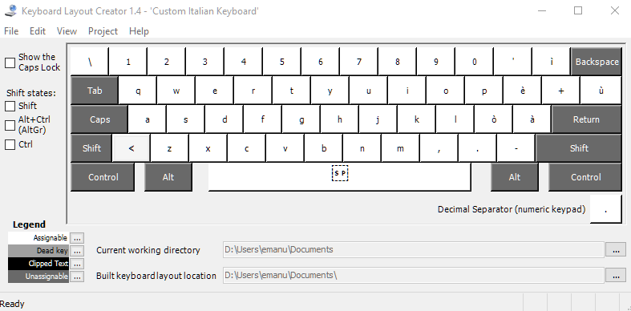
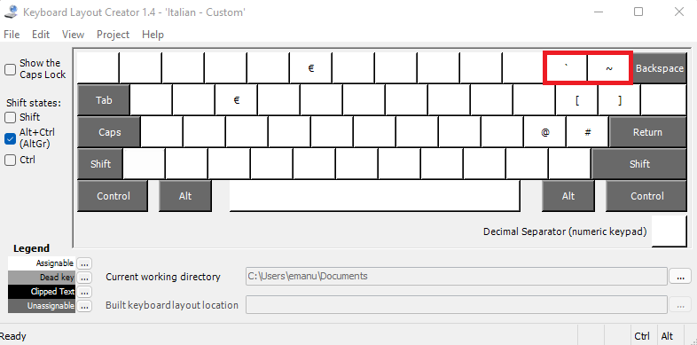
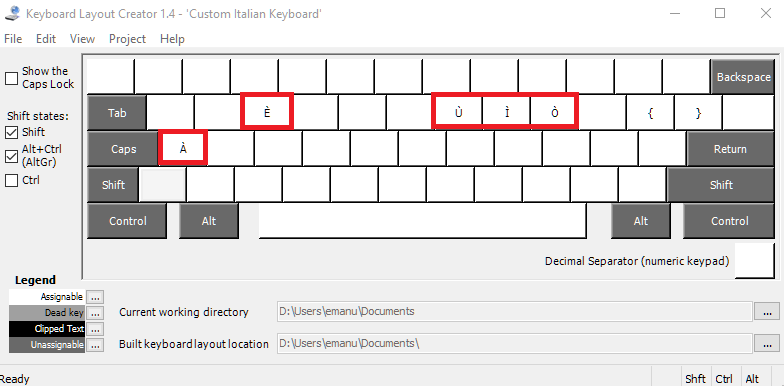

# Italian Programmer Keyboard Layout
This is a keyboard layout created for Italian programmers with [Microsoft Keyboard Layout Creator (MSKLC)](https://www.microsoft.com/en-us/download/details.aspx?id=102134) and that can therefore be added to the built-in layouts available on Windows.

It is a modified version of the standard Italian (NOT Italian 142) layout that adds the possibility to rapidly type the following characters by pressing the key combinations on the right:

- **` (backtick):** AltGr+'
- **\~ (tilde):** AltGr+ì
- **À:** AltGr+Shift+a
- **È:** AltGr+Shift+e
- **Ì:** AltGr+Shift+i
- **Ò:** AltGr+Shift+o
- **Ù:** AltGr+Shift+u

The backtick and tilde characters have the same key combinations that can be used on Linux systems.

This is how the keys are distributed on the Italian layout without pressing any key:

This is how the keys appear after pressing the AltGr key (in red the newly added characters):

And this is how they appear after pressing AltGr+Shift (in red the newly added characters):

## How to install

Just click on the `setup.exe` file or on the correct `.msi` file for your architecture. After that, you can go into your Windows settings and select the new layout from the list.

Alternatively, you can build the executable yourself by downloading the MSKLC tool and importing the `.klc` source file by going to `File -> Load Source File` and then on `Project -> Build DLL and Setup Package`.

## Motivation

I bought a mechanical keyboard without a numpad, you can guess the rest. Moreover, it is even faster than typing the Alt codes with the numpad.
